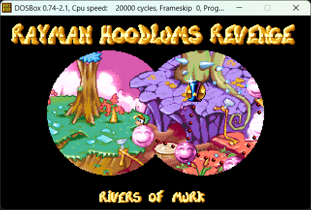

# Rayman 1 Archive Repacker

The **Rayman 1 Archive Repacker**, Ray1ArchiveRepacker for short, is a tool which allows modifying the contents of the archive files in the game. These are as follows:

- `RAY.LNG` - contains TXT files for the game's localized text
- `SNDH8B.DAT` & `SNDD8B.DAT` - contains the sfx sound banks
- `SNDVIG.DAT` - contains the vignette sound bank
- `VIGNET.DAT` - contains PCX files for the game backgrounds

Here's an example of an edit to showcase what you can do:

## How to use it

### General usage

The tool is a command-line tool, meaning it has no user interface and has to be run from the Command Prompt. In the future it is planned to integrate this into the Rayman Control Panel for easier usage and modding support.

To run it, open a Command Prompt window in the same folder as the exe (by typing `cmd` in the address bar) and type any of the following commands:

- `Ray1ArchiveRepacker -e <game-path> <output-path>`: Extracts all the archives to the output path
- `Ray1ArchiveRepacker -r <game-path> <input-path>`: Repacks all the archives from the input path

For example, use `Ray1ArchiveRepacker -r "C:\GOG Games\Rayman Forever\Rayman" "Archives"` to extract the archives from the GOG installation into a folder named "Archives".

Make sure to keep a backup of the files before repacking them!

### Editing

After extracting you will end up with a folder for each archive.

#### RAY (RAY.LNG)

This contains a .txt file for each language. You can freely edit the text in these, but keep the following in mind:

- The text encoding used is [code page 437](https://en.wikipedia.org/wiki/Code_page_437), which is important when using special characters in non-English languages.
- Each text entry has to end with a comma `,`.
- The file has to end with an asterisk `*`.
- Text which should be centered is enclosed in forward-slashes `/`.
- The Chinese and Japanese files define text through sprite indexes instead, having there be sprites corresponding to each of the text entries.

#### SND8B (SNDH8B.DAT & SNDD8B.DAT)

This contains a .wav file for each sound effect in the 7 available sound banks (one for each world, and then one for allfix). You can replace or edit these, but keep in mind that the format has to be the same:
- Uncompressed PCM audio
- Single channel (mono)
- Sample rate 11025
- 8-bit

Some files will have a corresponding .txt file with loop data. These contain the start point to loop back to and the length of each loop, both measured in samples.

#### SNDVIG (SNDVIG.DAT)

This contains a .wav for each vignette sound. You can replace or edit these, but keep in mind that the format has to be the same:
- Uncompressed PCM audio
- Single channel (mono)
- Sample rate 11025
- 16-bit

#### VIGNET (VIGNET.DAT)

This contains a .pcx file for each vignette (backgrounds, loading screens etc.). When editing these you have to keep in mind to preserve the original palette or else it will cause issues. A tool like Gimp can do this.
